# 🏗️ Framework Architecture

This document provides a comprehensive overview of the Playwright Automation Framework's architecture, design patterns, and technical implementation details.

## 📋 Table of Contents

1. [Architecture Overview](#architecture-overview)
2. [Design Patterns](#design-patterns)
3. [Core Components](#core-components)
4. [Data Flow](#data-flow)
5. [Security Architecture](#security-architecture)
6. [Performance Architecture](#performance-architecture)
7. [CI/CD Architecture](#cicd-architecture)
8. [Deployment Architecture](#deployment-architecture)
9. [Extension Points](#extension-points)
10. [Best Practices](#best-practices)

## 🎯 Architecture Overview

The Playwright Automation Framework follows a **layered, modular architecture** designed for scalability, maintainability, and enterprise-grade testing capabilities.

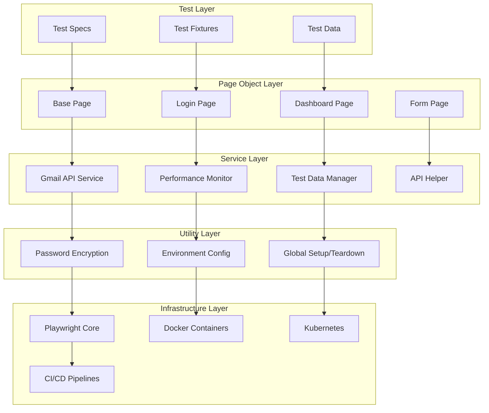

### Core Principles

- **Separation of Concerns**: Each layer has distinct responsibilities
- **Dependency Injection**: Loose coupling between components
- **Configuration-Driven**: Environment-specific behavior
- **Security-First**: Encrypted credentials and secure practices
- **Performance-Optimized**: Built-in monitoring and optimization
- **Cloud-Native**: Containerized and orchestrated deployment

## 🎨 Design Patterns

### 1. Page Object Model (POM)

```javascript
// Base Page - Common functionality
class BasePage {
  constructor(page) {
    this.page = page;
    this.performanceMonitor = new PerformanceMonitor(page);
  }
  
  async click(locator) {
    await this.page.click(locator);
  }
  
  async fill(locator, value) {
    await this.page.fill(locator, value);
  }
}

// Specific Page - Domain-specific functionality
class LoginPage extends BasePage {
  constructor(page) {
    super(page);
    this.usernameField = page.locator('#username');
    this.passwordField = page.locator('#password');
    this.loginButton = page.locator('button[type="submit"]');
  }
  
  async login(username, password) {
    await this.fill(this.usernameField, username);
    await this.fill(this.passwordField, password);
    await this.click(this.loginButton);
  }
}
```

### 2. Service Layer Pattern

```javascript
// Service abstraction for external APIs
class GmailApiService {
  constructor() {
    this.auth = new OAuth2Client();
    this.gmail = google.gmail({ version: 'v1', auth: this.auth });
  }
  
  async findEmails(query) {
    // Gmail API implementation
  }
}

// Hybrid service combining API + Playwright
class GmailPlaywrightService extends BasePage {
  constructor(page) {
    super(page);
    this.gmailApiService = new GmailApiService();
  }
  
  async clickEmailLink(email, linkText) {
    // Combines Gmail API + Playwright actions
  }
}
```

### 3. Factory Pattern

```javascript
// Test data factory
class TestDataFactory {
  static createUser(options = {}) {
    return {
      username: faker.internet.userName(),
      email: faker.internet.email(),
      password: faker.internet.password(),
      ...options
    };
  }
  
  static createProduct(category = 'electronics') {
    return {
      name: faker.commerce.productName(),
      price: faker.commerce.price(),
      category: category
    };
  }
}
```

### 4. Observer Pattern

```javascript
// Performance monitoring with observers
class PerformanceMonitor {
  constructor(page) {
    this.page = page;
    this.observers = [];
  }
  
  addObserver(observer) {
    this.observers.push(observer);
  }
  
  notifyObservers(metrics) {
    this.observers.forEach(observer => observer.update(metrics));
  }
}
```

## 🧩 Core Components

### 1. Test Execution Layer

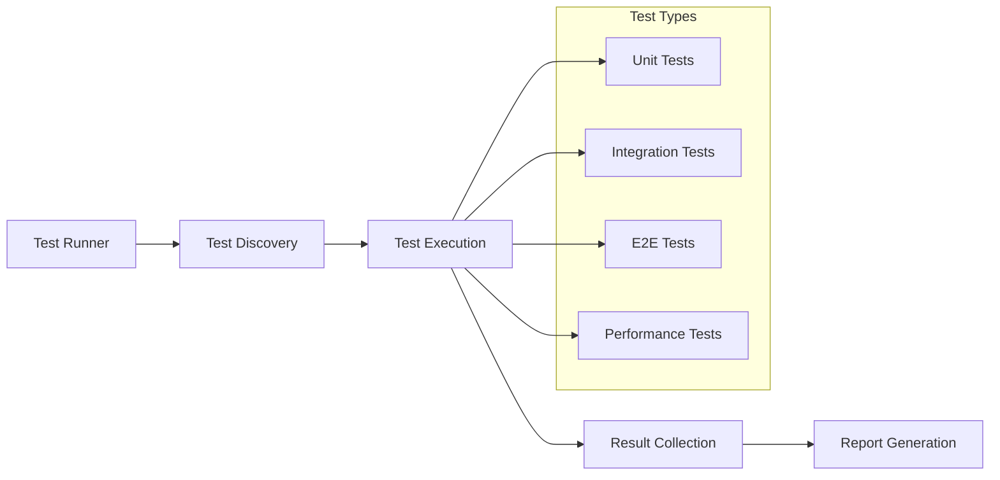

**Components:**
- **Test Specs**: Individual test files (`*.spec.js`)
- **Test Fixtures**: Reusable test data and setup
- **Test Data**: Dynamic and static test data
- **Test Runner**: Playwright test execution engine

### 2. Page Object Layer

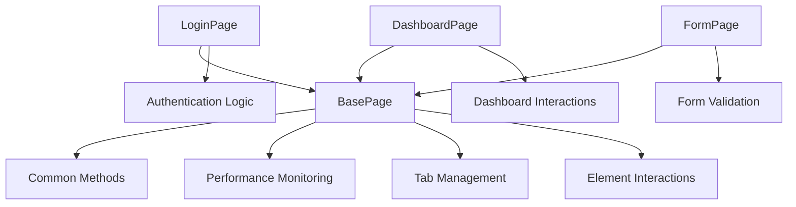

**Key Features:**
- **Inheritance**: All pages extend BasePage
- **Composition**: Services injected into pages
- **Encapsulation**: Page-specific logic contained
- **Reusability**: Common functionality shared

### 3. Service Layer

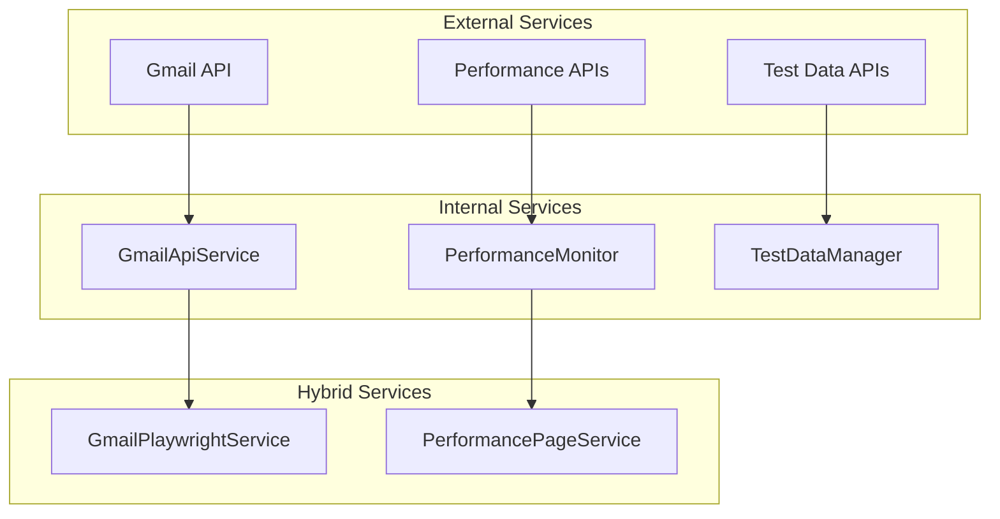

**Service Types:**
- **API Services**: Direct external API integration
- **Playwright Services**: Browser automation services
- **Hybrid Services**: Combined API + Playwright functionality

### 4. Utility Layer

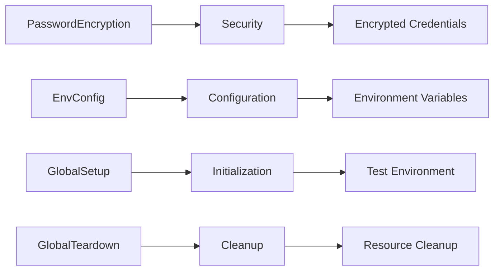

## 🔄 Data Flow

### 1. Test Execution Flow

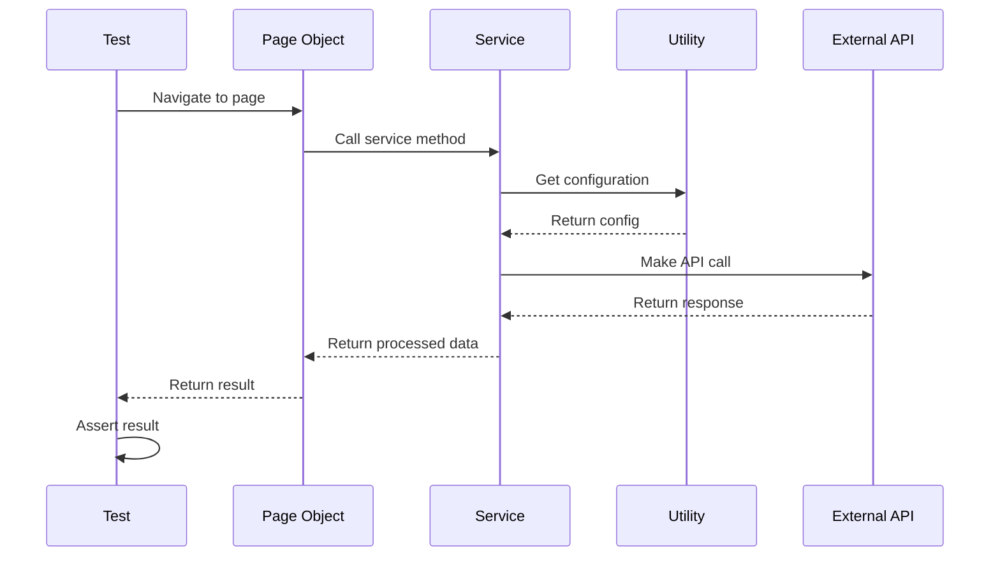

### 2. Authentication Flow

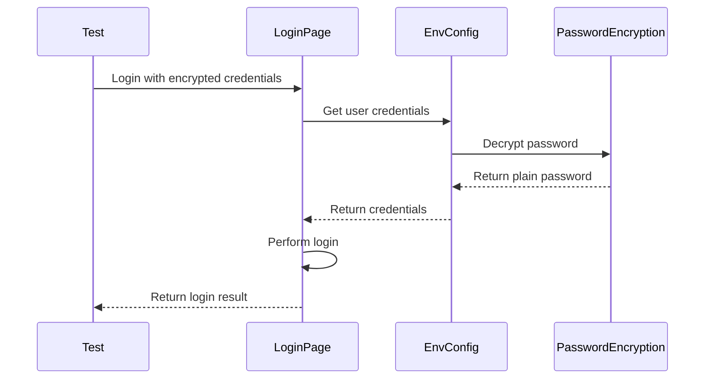

### 3. Performance Monitoring Flow

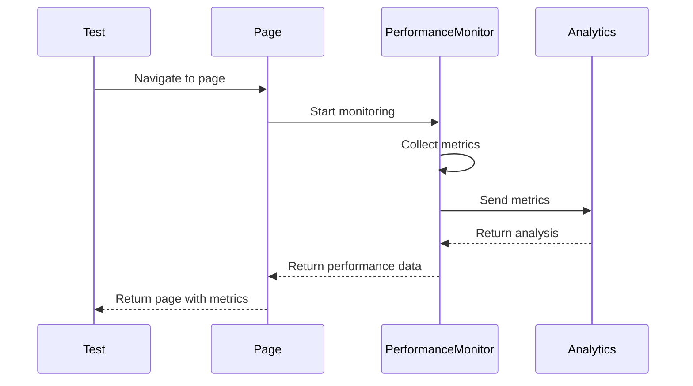

## 🔒 Security Architecture

### 1. Credential Management

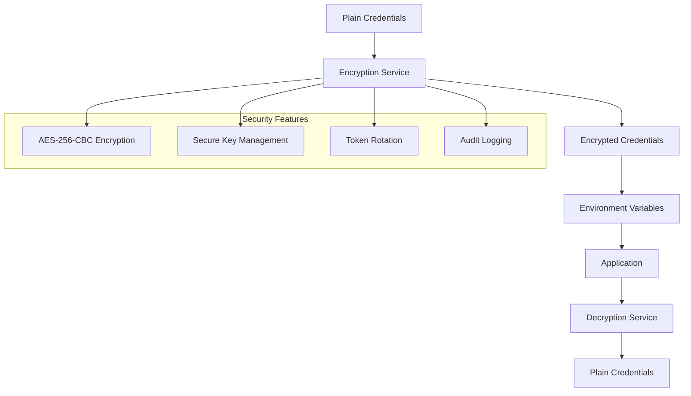

### 2. API Security

```javascript
// Secure API authentication
class SecureApiClient {
  constructor() {
    this.encryption = new PasswordEncryption();
    this.token = this.getSecureToken();
  }
  
  async makeRequest(endpoint, data) {
    const headers = {
      'Authorization': `Bearer ${this.token}`,
      'Content-Type': 'application/json',
      'X-Request-ID': this.generateRequestId()
    };
    
    return await this.httpClient.post(endpoint, data, { headers });
  }
}
```

## ⚡ Performance Architecture

### 1. Monitoring Stack

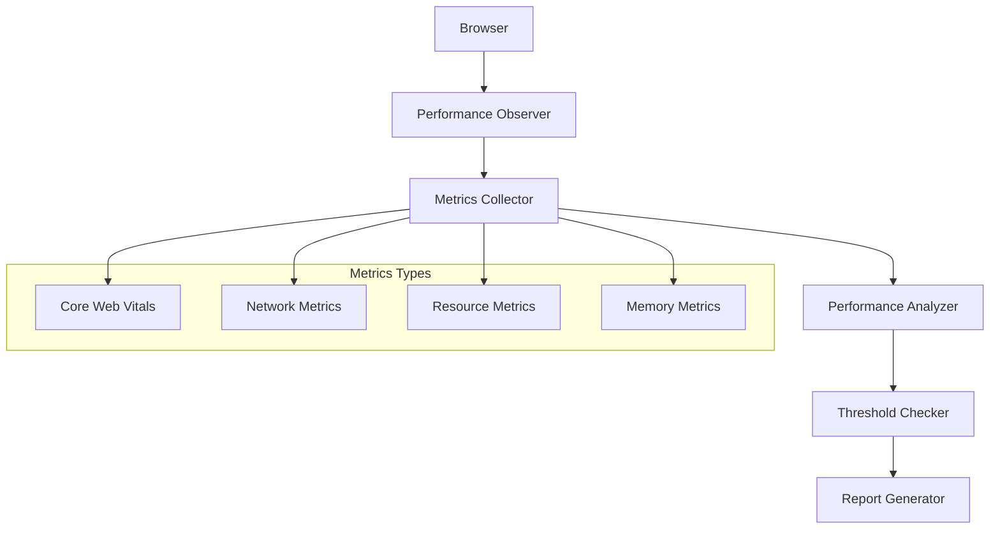

### 2. Performance Optimization

```javascript
// Performance-optimized page object
class OptimizedPage extends BasePage {
  async navigateAndMeasure(url) {
    const startTime = performance.now();
    
    // Preload critical resources
    await this.preloadCriticalResources();
    
    // Navigate with performance monitoring
    await this.page.goto(url, { 
      waitUntil: 'networkidle',
      timeout: 30000 
    });
    
    // Collect performance metrics
    const metrics = await this.collectMetrics();
    
    // Analyze and report
    await this.analyzePerformance(metrics);
    
    return metrics;
  }
}
```

## 🚀 CI/CD Architecture

### 1. Pipeline Flow

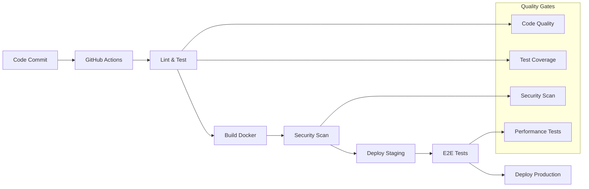

### 2. Multi-Environment Deployment

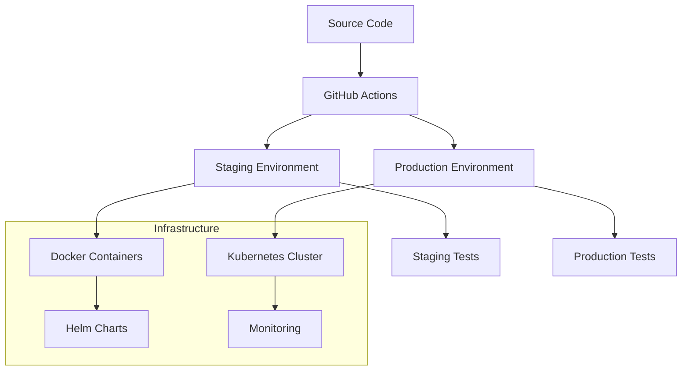

## 🏗️ Deployment Architecture

### 1. Container Architecture

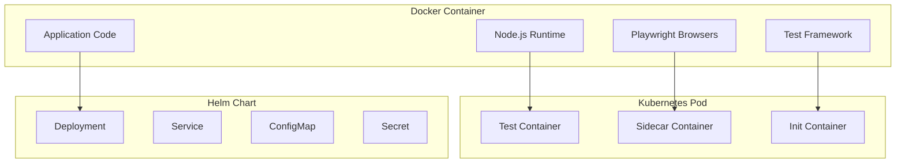

### 2. Scalability Architecture

```javascript
// Horizontal scaling configuration
const scalingConfig = {
  minReplicas: 2,
  maxReplicas: 10,
  targetCPUUtilization: 70,
  targetMemoryUtilization: 80,
  scalingPolicies: {
    scaleUp: {
      stabilizationWindowSeconds: 60,
      policies: [
        { type: 'Pods', value: 2, periodSeconds: 60 }
      ]
    },
    scaleDown: {
      stabilizationWindowSeconds: 300,
      policies: [
        { type: 'Pods', value: 1, periodSeconds: 60 }
      ]
    }
  }
};
```

## 🔌 Extension Points

### 1. Custom Page Objects

```javascript
// Extending base functionality
class CustomPage extends BasePage {
  constructor(page) {
    super(page);
    this.customLocators = {
      specialButton: page.locator('[data-testid="special-button"]'),
      customField: page.locator('#custom-field')
    };
  }
  
  async customAction() {
    // Custom implementation
    await this.click(this.customLocators.specialButton);
  }
}
```

### 2. Custom Services

```javascript
// Adding new service integrations
class CustomApiService {
  constructor(baseUrl, apiKey) {
    this.baseUrl = baseUrl;
    this.apiKey = apiKey;
  }
  
  async customMethod() {
    // Custom API implementation
  }
}
```

### 3. Custom Test Data

```javascript
// Extending test data generation
class CustomTestDataManager extends TestDataManager {
  generateCustomData(type, options = {}) {
    switch(type) {
      case 'customEntity':
        return this.generateCustomEntity(options);
      default:
        return super.generateData(type, options);
    }
  }
}
```

## 📋 Best Practices

### 1. Architecture Principles

- **Single Responsibility**: Each component has one clear purpose
- **Open/Closed**: Open for extension, closed for modification
- **Dependency Inversion**: Depend on abstractions, not concretions
- **Interface Segregation**: Small, focused interfaces
- **Don't Repeat Yourself**: Reusable components and utilities

### 2. Code Organization

```javascript
// Recommended file structure
project/
├── pages/           # Page Object classes
├── services/        # Service layer
├── utils/           # Utility functions
├── tests/           # Test specifications
├── fixtures/        # Test data
├── config/          # Configuration files
└── docs/            # Documentation
```

### 3. Error Handling

```javascript
// Centralized error handling
class ErrorHandler {
  static handleTestError(error, context) {
    console.error(`Test failed in ${context}:`, error.message);
    
    // Log to monitoring system
    this.logToMonitoring(error, context);
    
    // Take screenshot for debugging
    this.captureScreenshot(context);
    
    // Clean up resources
    this.cleanup(context);
  }
}
```

### 4. Performance Considerations

- **Lazy Loading**: Load resources only when needed
- **Connection Pooling**: Reuse HTTP connections
- **Caching**: Cache frequently used data
- **Parallel Execution**: Run independent tests in parallel
- **Resource Cleanup**: Properly dispose of resources

## 🎯 Conclusion

This architecture provides a solid foundation for enterprise-grade test automation with:

- **Scalability**: Horizontal and vertical scaling capabilities
- **Maintainability**: Clear separation of concerns and modular design
- **Security**: Comprehensive security measures and best practices
- **Performance**: Built-in monitoring and optimization
- **Flexibility**: Easy extension and customization points
- **Reliability**: Robust error handling and recovery mechanisms

The framework is designed to grow with your testing needs while maintaining high code quality and performance standards.
